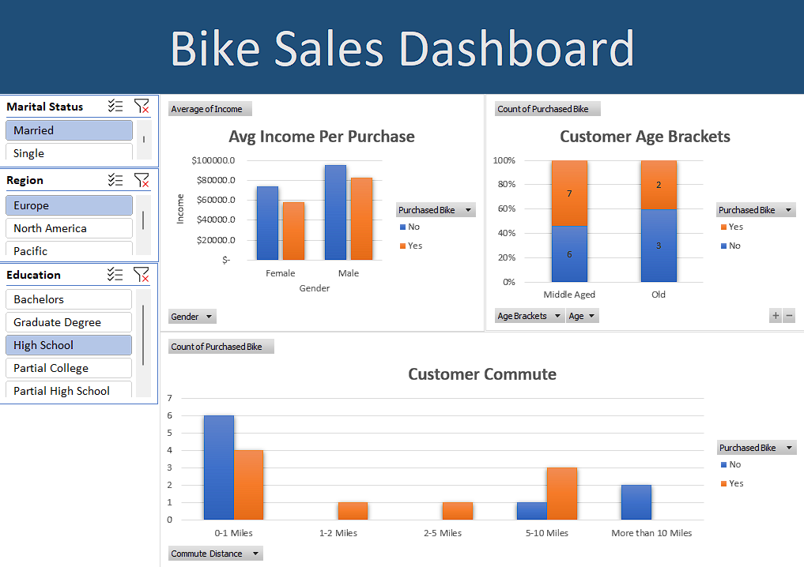

# 🚴‍♂️ Bike Sales Customer Analysis

## 📊 Dashboard

## 📋 Project Overview
Analyzed and visualized bike shop customer data using Microsoft Excel to identify customer segments and purchasing patterns. Developed an interactive dashboard for segmentation based on demographics (age, gender, marital status, education), commute distance, and region. The project aims to support pricing strategies and optimize revenue by understanding key customer behaviors.

## 🛠️ Tools & Techniques
- Microsoft Excel
- Pivot Tables & Pivot Charts
- Slicers for interactive filtering
- Conditional Formatting
- Lookup & Statistical Functions

## 📁 Dataset
The dataset includes customer information such as:
- Demographics (Age, Gender, Marital Status, Education)
- Commute Distance
- Region
- Income
- Bike Purchase Status (Yes/No)

## 🔍 Key Insights
- Higher income levels correlate with increased bike purchases, especially among males.
- Middle-aged customers represent the majority of purchases, compared to older segments.
- Customers commuting shorter distances (0-1 miles) are more likely to purchase bikes.
- Regional differences and educational background also influence purchasing behavior.

